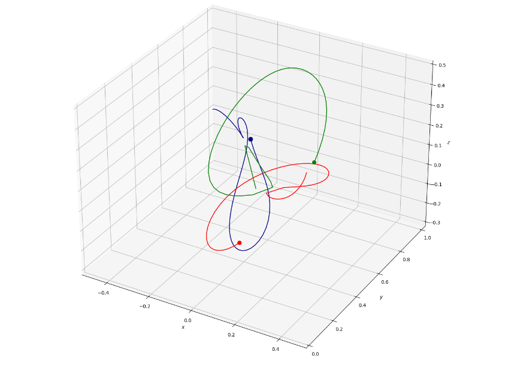

# Three-body problem

Numerical solution for the ODE of motion under gravity forces for $n$ bodies and correspondent visualization with animation.

Inspired by the book "The Three-Body Problem", and [post by Gaurav Deshmukh](https://towardsdatascience.com/modelling-the-three-body-problem-in-classical-mechanics-using-python-9dc270ad7767).

